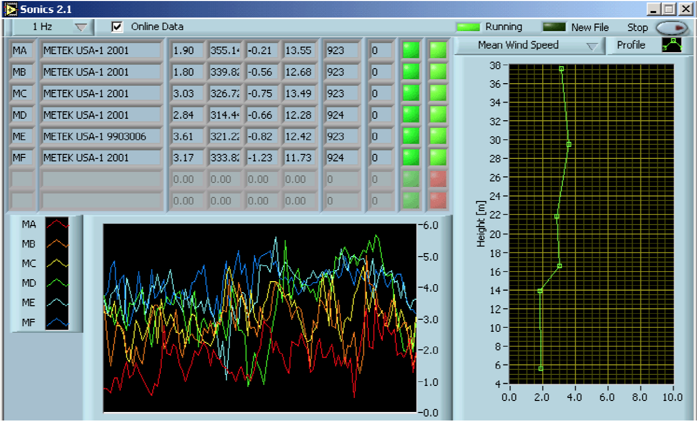

# Ultrasonic-Anemometers (V 2.2)

## Description

A LabView-based serial logger vi to write and visualize time-synchronized data from ultrasonic-anemometers (up to 32 systems). The system allows defining sensors and parses their data for online (real-time) visualization. It writes raw data to files in predefined time intervals (usually 30 min). A log file summarizes statistics and errors during data aquisition. I have developed this software at the University of Basel between 1999 and 2005. Since 2008 it has not been further updated anymore.

This software has been used in several past micrometeorological research projects I have been involved, and is archived here in the latest version (Version 2.2). Research projects where this software (or preceeding version) have been used for data samplig included:

* Basel Urban Boundary Layer Project 2002 (BUBBLE), sites BSPR, BSPA, ALLS, GRNZ (Rotach et al., 2005)
* EBEX 2000 (Site 9, Oncley et al., 2007)
* MAP Riviera 1999 (Rotach et al., 2004)
* HX06 in Hartheim, Germany 2006 (http://ibis.geog.ubc.ca/~achristn/research/hx06/)
* ADVEX (Feigenwinter et al., 2008)
* WATERUSE 2001 - 2003 (Canosa di Puglia campaigns, Rio Frio campaign)

## Content

### Directory "Development"

The subdirectory "Development" contains all LabView VIs that are required to build the application.

### Directory "Installer"

The directory "Installer" contains a Windows Installer for a stand-alone Version that runs with Lab View Run Time 6.02.

## References

Feigenwinter C., Bernhofer C., Eichelmann U., Heinesch B., Hertel M., Janous D., Kolle O., Lagergren F., Lindroth A., Minerbi S. 2008. “Comparison of Horizontal and Vertical Advective CO2 Fluxes at Three Forest Sites.” Agricultural and Forest Meteorology 148 (1): 12–24. http://dx.doi.org/10.1016/j.agrformet.2007.08.013.

Oncley S. P., Foken T., Vogt R., Kohsiek W., DeBruin H.A.R., Bernhofer C., Christen A., van Gorsel E., Grantz D., Feigenwinter C., Lehner I., Liebethal C., Liu H., Mauder M., Pitacco A., Ribeiro L., Weidinger T. (2007): 'The Energy Balance Experiment EBEX-2000. Part I: Overview and energy balance'. Bound.-Layer Meteorol. 123 (1): 1-28 http://dx.doi.org/10.1007/s10546-007-9161-1

Rotach M.W., Vogt R., Bernhofer C., Batchvarova E., Christen A., Clappier A., Feddersen B., Gryning S.-E., Martucci G., Mayer H., Mitev V., Oke T.R., Parlow E., Richner H., Roth M., Roulet Y.A., Ruffieux D., Salmond J., Schatzmann M., Voogt J. (2005): 'BUBBLE - an Urban Boundary Layer Meteorology Project'. Theor. Appl. Climatol. 81 (3-4): 231-261 http://dx.doi.org/10.1007/s00703-003-0060-9

Rotach M.W., Calanca P., Graziani G., Gurtz J., Steyn D.G., Vogt R., Andretta M., Christen A., Cieslik S., Connolly R., De Wekker S.F.J., Galmarini S., Kadygrov E.N., Kadygrov V., Miller E., Neininger B., Rucker M., van Gorsel E., Weber H. Weiss A., Zappa M. (2004): 'Turbulence Structure and Exchange Processes in an Alpine Valley: The Riviera Project'. Bull. Amer. Met. Soc. 85 (9): 1367-1385 http://dx.doi.org/10.1175/BAMS-85-9-1367
